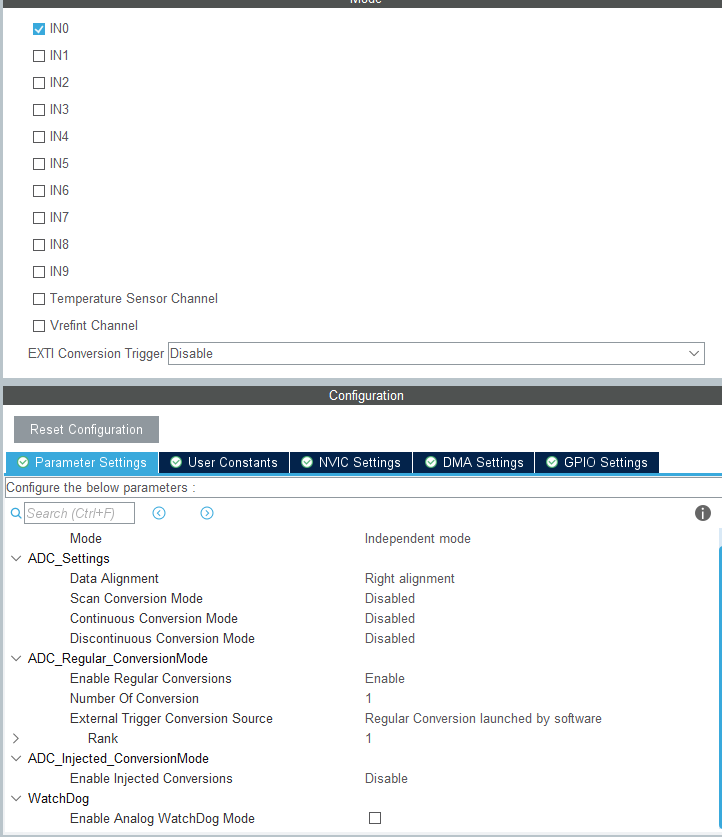
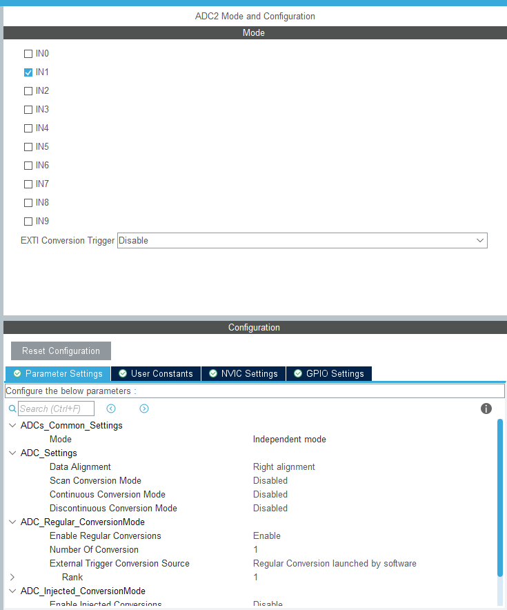
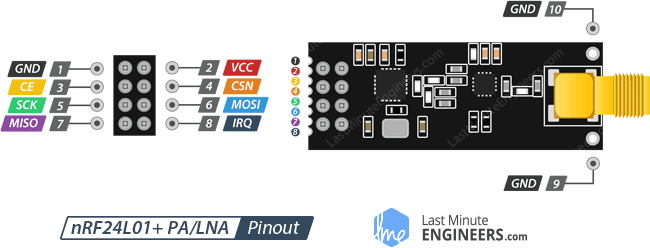
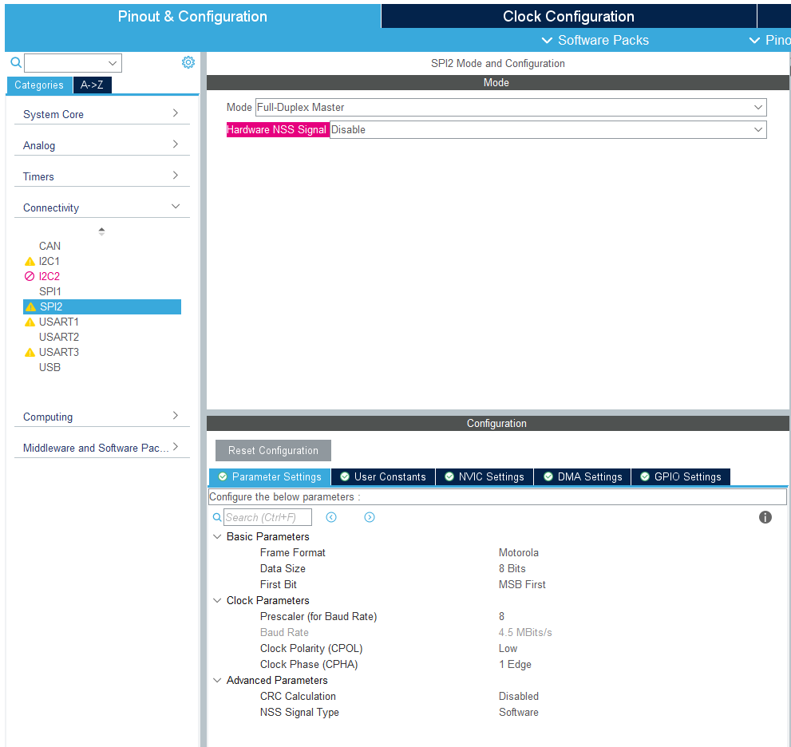
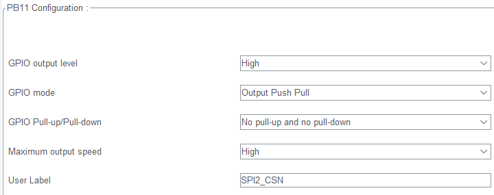
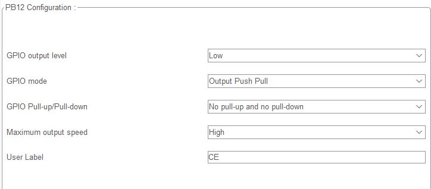
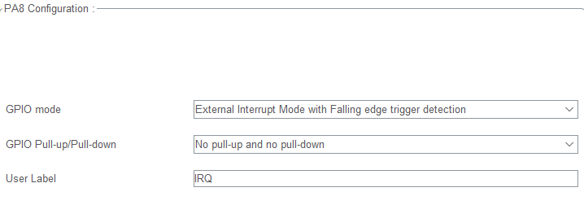
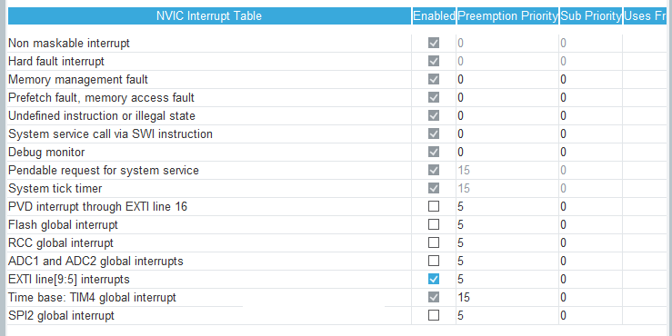
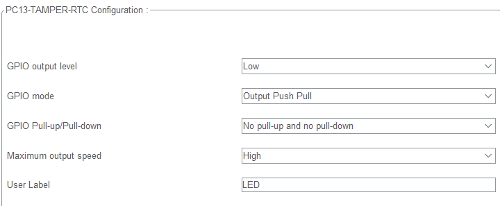
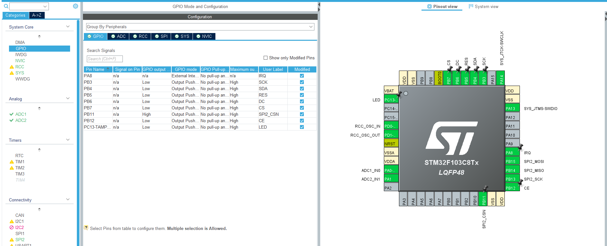

# 遥控车的控制器

## ADC采样

使用CUbeMX初始化ADC



在初始化中你只需要选择一个通道,其他什么都不用管,默认即可

对ADC2也是一样



下面一段代码演示了我如何使用ADC,总共分三步,启动ADC,等ADC转换完成,读取ADC值就行

```c
void ADCFunction(void const * argument)
{
  /* USER CODE BEGIN ADCFunction */

  /* Infinite loop */
  for(;;)
  {
      HAL_ADC_Start(&hadc1);								//启动ADC转换
      HAL_ADC_Start(&hadc2);

      if(HAL_ADC_PollForConversion(&hadc1,5)==HAL_OK){		//等待ADC转换完成
          ADC1Value= HAL_ADC_GetValue(&hadc1);				//读取ADC值
      }

      if(HAL_ADC_PollForConversion(&hadc2,5)==HAL_OK){
          ADC2Value= HAL_ADC_GetValue(&hadc2);
      }

      Tx_Data[0]=(uint8_t)(ADC1Value);      //ADC1数据低八位
      Tx_Data[1]=(uint8_t)(ADC1Value>>8);   //ADC1数据高八位

      Tx_Data[2]=(uint8_t)(ADC2Value);      //ADC2数据低八位
      Tx_Data[3]=(uint8_t)(ADC2Value>>8);   //ADC2数据高八位

    osDelay(1);
  }
  /* USER CODE END ADCFunction */
}
```

___


## NRF24L01通信模块

该模块使用硬件SPI控制,你需要再CubeMX中初始化一个SPI和若干引脚

此外可以引用别人的[stm32_hal_nrf24l01p](https://github.com/mokhwasomssi/stm32_hal_nrf24l01p#dev-environment)

### 模块引脚




| Name                 | Description               |
| -------------------- | ------------------------- |
| VCC, GND             | Power Supply, 1.9V - 3.6V |
| MOSI, MISO, SCK, CSN | SPI                       |
| CE                   | Chip Enable               |
| IRQ                  | Interrupt Pin, Active Low |

## STM32CUBEMX

这里使用SPI2的全双工模式,将Prescaler设定为8,其他默认




设定SPI2_CSN引脚GPIO_Output,这里默认输出电平要设为**高电平**




设定CE引脚GPIO_Output,这里默认输出**低电平**




还有一个外部中断IRQ引脚PA8,由于模块接收信号IRQ引脚会置零,因此这里GPIO mode设定为**下降沿触发**



此外还需在NVIC中打开外部中断,设定好合适的优先级



然后初始化部分就到此为止了


注意:

该程序中包含一个指示灯,你需要初始化PC13引脚.这不是必须的,没有它模块照样能够通信



___

接下来是代码部分

toy_car_controller/Core/Inc 中有nrf24l01p.h

toy_car_controller/Core/Src 中有nrf24l01p.c

这两个是模块的驱动代码

在nrf24l01p.h中有引脚定义,你需要检查引脚是否正确

```c
/*
 * SPI2引脚说明(stm32f103c8t6)
 * SPI2_SCK->PB13
 * SPI2_MISO->PB14
 * SPI2_MOSI->PB15
 * */
#define NRF24L01P_SPI                     (&hspi2)

#define NRF24L01P_SPI_CS_PIN_PORT         GPIOB
#define NRF24L01P_SPI_CS_PIN_NUMBER       GPIO_PIN_11

#define NRF24L01P_CE_PIN_PORT             GPIOB
#define NRF24L01P_CE_PIN_NUMBER           GPIO_PIN_12

#define NRF24L01P_IRQ_PIN_PORT            GPIOA
#define NRF24L01P_IRQ_PIN_NUMBER          GPIO_PIN_8

#define NRF24L01P_PAYLOAD_LENGTH          8     // 1 - 32bytes这个参数用于控制发送数组的长度
```

发射器的代码

下面的代码演示了如何使用NRF24L01发射信息

```c
uint8_t Tx_Data[NRF24L01P_PAYLOAD_LENGTH]={0,0,0,0,0,0,0,0};		//设定好
/*
 * @brief    NRF24L01控制函数
 * @param    argument
 * @retval   void
 * */
void NRF24L01Function(void const * argument)
{
  /* USER CODE BEGIN NRF24L01Function */
  nrf24l01p_tx_init(2500,_1Mbps);		//初始化模块
  /* Infinite loop */
  for(;;)
  {
    nrf24l01p_tx_transmit(Tx_Data);		//发送信息,填入发送数据数组名
    osDelay(1);
  }
  /* USER CODE END NRF24L01Function */
}
/*
 * @brief    NRF24L01模块触发中断的回调函数
 * @note     触发方式是下降沿触发
 * @param    GPIO_Pin,触发中断的引脚
 * @retval   void
 * */
void HAL_GPIO_EXTI_Callback(uint16_t GPIO_Pin)		//再次强调,设定PA8时一定要设定为下降沿触发
{
    if(GPIO_Pin == NRF24L01P_IRQ_PIN_NUMBER)
       nrf24l01p_tx_irq(); // clear interrupt flag
}
```

至此无线模块部分结束

____

## OLED屏幕

在CubeMX中定义一些引脚



Core/Inc/bmp.h

Core/Inc/oled.h

Core/Inc/oledfont.h

Core/Src/oled.c

以上是OLED所需的驱动文件

下面代码演示了如何使用

```c
void LEDFunction(void const * argument)
{
  /* USER CODE BEGIN LEDFunction */
    OLED_Init();		//初始化OLED

  /* Infinite loop */
  for(;;)
  {
      OLED_ShowString(2,0,"ADC_Value:");
      OLED_ShowNum(2,2,ADC1Value,4,SIZE);
      OLED_ShowNum(2,4,ADC2Value,4,SIZE);
    osDelay(1);
  }
  /* USER CODE END LEDFunction */
}
```

